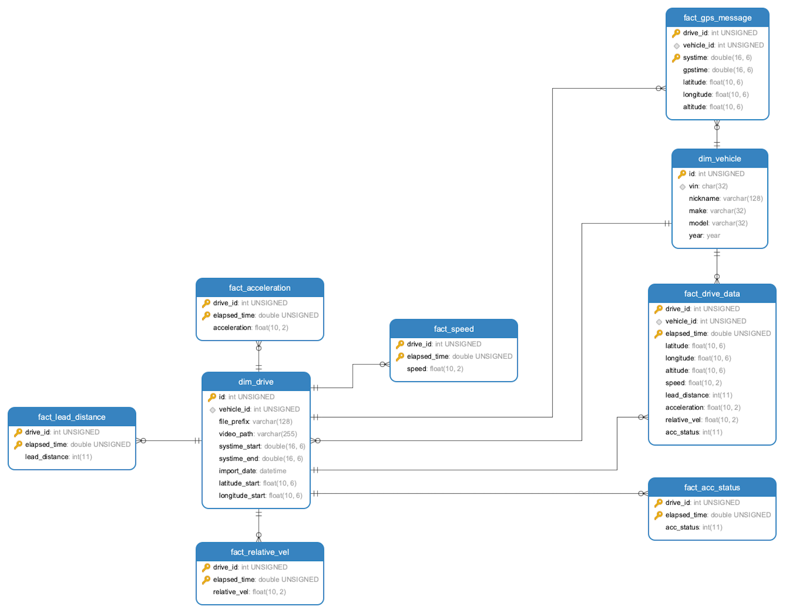

### Capstone database installation

1. ##### Requirments

   First create virtual environment:

   ```
   conda create -n strym "python=3.7"
   conda activate strym
   ```

   install the following modules

   ```
   pip install strym
   pip install SQLAlchemy==1.4.35
   pip install PyMySQL==1.0.2
   ```

2. **Quick start**

   ```
   1.learn to connect to you database.(look at step 3)
   2.Create tables.(run all cells in creat_table.ipynb)
   2.insert all the data (run all cells in batch_insert.ipynb)
   ```

   

3. ##### Create tables

   First create your tables in your database. You only need to run the cell at first time use the database.

   **Just run all the cells after connecting to your database.**

   1. If you need connect to your database. Here is an example:

      ```python
      m_host='sh-cynosdbmysql-grp-75qwodo8.sql.tencentcdb.com'
      m_port =29563
      m_user='capstone'
      m_password='capstone123!!!'
      m_db='circle_database_version3'
      ```

   2. here is the the relations of all tables:

      

4. ##### **Batch insert**

   1. a. batch_insert.ipynb will help you inset all the information needed for the project. 

      1. `can_list, gps_list = get_all_file('.')` : get all files needed to insert to database.

      2. insert GPS, CAN and generated data to database.

         ```python
         for file in gps_list:
             fact_gps_message.insert_record_to_fact_gps_message(file)
         
         for file in can_list:
             fact_features.insert_all_records(file)
         
         for can_file in can_list:
             gps_file = can_file.replace('CAN', 'GPS')
             if gps_file in gps_list:
                     fact_drive_data.insert_fact_drive_data(can_file,gps_file)
         ```


   2. we use three ipynb in our project like follows:

   ```
   import fact_features
   import fact_gps_message
   import fact_drive_data
   ```

   The fact_features file is used to insert features. The fact_gps_message is used to insert gps information. The fact_drive_data is used to generate tables for combined information. We will talk about them later.

   3. We  ues  `get_all_file(dir_name)` to get all the file we need to update to database. Make sure all the csv files are in the same dir. you can all change the serach range by changing the dir_name.

   

   **===========================all you need to do is finished================================**

   **=============the following are some details for you to build your own database=============**

   

5. ##### **Common functions**

   1. For the beginning, we should stress that with VIN and time, we can identify each driving test. The vehicle_id is the primary key for `dim_vehicle` and the drive_id is the primary key for `dim_drive`. The file_prefix is the time in the form of `"yyyy-mm-dd-hh-mm-ss"`.
   2. `r =strymread(csvfile=file)/g = strymmap(csvfile=file)` is used to read dataframe from csvfile. It is based on strym. The object `r/g` stores data from CSV file. For more information, https://jmscslgroup.github.io/strym/getting_started.html
   3. `get_vin(file)`,`get_file_prefix(file)` : get basic information from the file_name. VIN is to identify the car while the file prefix can be used to find the file in the future.
   4. `get_vehicle_id(vin)` : get the vehicle_id from database. You input the VIN in form of string and it will help you seach from the database. If the VIN has already existed, it will return you the id. If not, it will creat a new record and return the vehicle id.
   5. `get_dim_drive_record_with_filename(filename)` : get the drive_id from database. you input the filename and it will help you search from database. if the driving_test has already existed, it will return you the id. If not, it will create a new record for the driving test and return you the drive id.
   6. `batch_update(df,table,username,password,server,database)` : update the data frame to the table in the database. The remain parameters are all for the access to the database.

6. ##### **Fact features**

   1. `get_fact_xxx(drive_id,r)` functions are used to get the dataframe from the object `r`. you can assume it as a combined ddataframe. What we are trying to do is to get the information we want. The drive_id is used to generated the dataframe for insert.

      for the speed features we need more process to remove some useless data. it is caused by the leading record car(usually marked as bus0). So in our project we remove the speed from bus0.

   2. `insert_record_to_fact_xxx(file)` :

      1. `r =strymread(csvfile=file)`
      2. get drive_id with the function `get_dim_drive_record_with_filename(file)`
      3. get dataframe with the function `get_fact_xxx(drive_id,r)`
      4. update with the  function `batch_update()`

   3. `insert_all_records(file)` :insert all features to the database. Now we have `fact_speed`, `fact_acceleration` , `fact_lead_distance` and `fact_acc_status`.  

7. ##### **Fact gps messages**

   1. `get_start_end_gps_info(df)` : get start_time, end_time and start latitude and longitude. The main issue is to define the start time. When you start the gps record, it will synchronize to satellite time. It need to be fixed in the future. We did not find a perfect method to find the start time. Now we just use the third record as start time.
   2. `get_fact_gps_message(vehicle_id,drive_id,g)`  it is similiar with `get_fact_xxx(drive_id,r)` , just changed to gps information.
   3. `insert_record_to_fact_gps_message(file)` 
      1. `g =strymmap(csvfile=file)`
      2. get vehicle_id with the function`get_vehicle_id(get_vin(file))`
      3. get drive_id with the function `get_dim_drive_record_with_filename(file)`
      4. get dataframe with the function `get_fact_gps_message(vehicle_id,drive_id,g)`
      5. update with the  function `batch_update()`

   4. `update_start_end_info(vehicle_id,file_prefix,start_time,end_time,latitude_start,longitude_start)` : when we get the gps information, we need to only insert to gps tables, but also update some columns in `dim_drive`. This is update start time, start position and end time for `dim_drive`.

8. ##### **Fact drive data**

   1. in this part we want to generate the table with fixed time sampling rate with the function `insert_fact_drive_data(can_file,gps_file)` We will do the following tasks to features table and gps tables, then we merge them.
      1. Firstly, we get the start_time and end_time and generate the series from start_time to end_time with time interval of 0.1s (take 10 Hz) sampling rate as an example.
      2. Secondly, We use merge the time table with data table and use 'left merge' to keep all the time we have.
      3. Lastly, we use the `interpolate()` to full all the missed data.

9. ##### Issues

   if you have any question, please raise up to improve our project! Thanks!


 